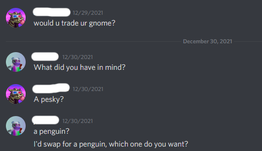
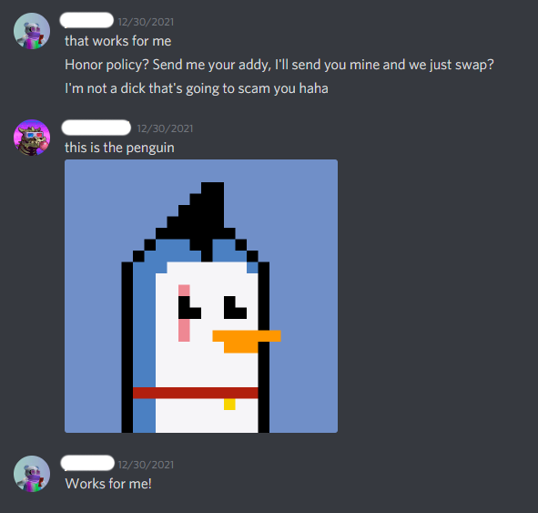
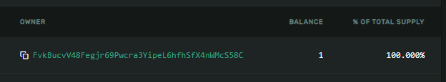

# Panda Private Eyes

Welcome to Panda Private Eyes. If you're here, you've probably been the victim of a scam in the Solanaverse. This repository is a proof-of-concept about how Panda Private Eyes can bring some Wild West-style justice to the SolScammers.  

#### IT HAPPENED TO ME  
There I was, minding my own business. I was trying to diversify my NFT portfolio by liquidating some rare Pawnshop Gnomies. I posted my gnomies in the Buy/Sell section of the Discord, and a few days later, I get a message...

I know, I know. What a rube. But I'm a good person, and I just was feeling magnanimous about society. My mistake, but my mistakes continue...  

Ready for the understatement of the year? Yes...I am that dumb...

Now, before I sent my gnomie, I checked the scammers wallet on the Solana Explorer. Indeed, he did hold the [PeskyPenguin](https://explorer.solana.com/address/3C5PXZYyPQWe1UEhuYMbmBdnsoWGRUe4YYmLBLojH27Z/largest) he was purporting to trade.  

