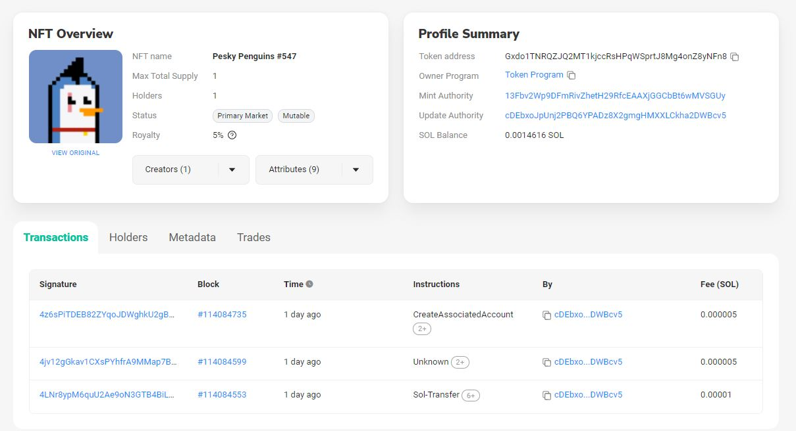

# Panda Private Eyes

Welcome to Panda Private Eyes. If you're here, you've probably been the victim of a scam in the Solanaverse. This repository is a proof-of-concept about how Panda Private Eyes can bring some Wild West-style justice to the SolScammers.  

#### IT HAPPENED TO ME  
There I was, minding my own business. I was trying to diversify my NFT portfolio by liquidating some rare Pawnshop Gnomies. I posted my gnomies in the Buy/Sell section of the Discord, and a few days later, I get a message...

I know, I know. What a rube. But I'm a good person, and I just was feeling magnanimous about society. My mistake, but my mistakes continue...  

Ready for the understatement of the year? Yes...I am that dumb...

Now, before I sent my gnomie, I checked the scammers wallet on the Solana Explorer. Indeed, he did hold the [PeskyPenguin](https://explorer.solana.com/address/3C5PXZYyPQWe1UEhuYMbmBdnsoWGRUe4YYmLBLojH27Z/largest) he was purporting to trade.  

So I sent my gnomie, and he sent...[this](https://solscan.io/address/DPDswWavy7QL74RCZFAKi6Pfh5e7AZjFnuJ638yujja)...  

  

This is a clone/print of the original PeskyPenguin. The metadata matches ~95%, but there were tell-tale signs.  

#### So what can we do?  

At Penguin Private Eyes, we aim to assist the scammed by compiling detailed reports that lay out the course of events. We will:  

1. Do a forensic analysis of the transfer and chat logs to ensure a crime was committed.  
2. Do a deep-dive on the scammers information.  
3. Post all related wallets/social media to our searchable Hall of Shame.  
4. Reach out to project devs to see about flagging the stolen NFT ('*Can the devs do something?*')    
5. Enable real-time tracking of the stolen NFT on the blockchain. If sold on a legitimate market, we plan to distribute and NFT notice to the buyer that they have unwittingly purchased stolen goods.  
6. Search all related wallets of the scammers to identify any more fake (or real NFTs) and add them to a searchable database.  

In short, let's inflict a little Wild West justice on these turds...  

More to come...  
